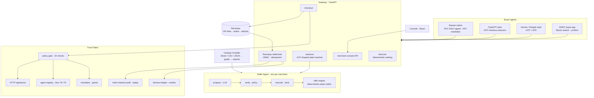
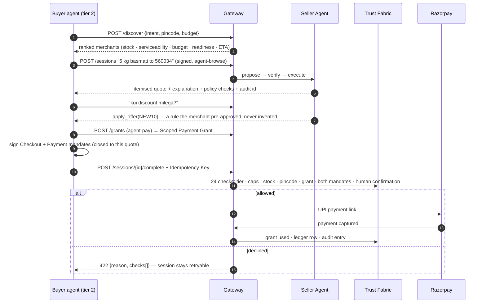
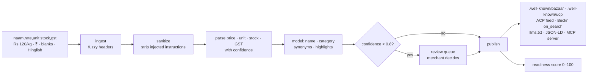
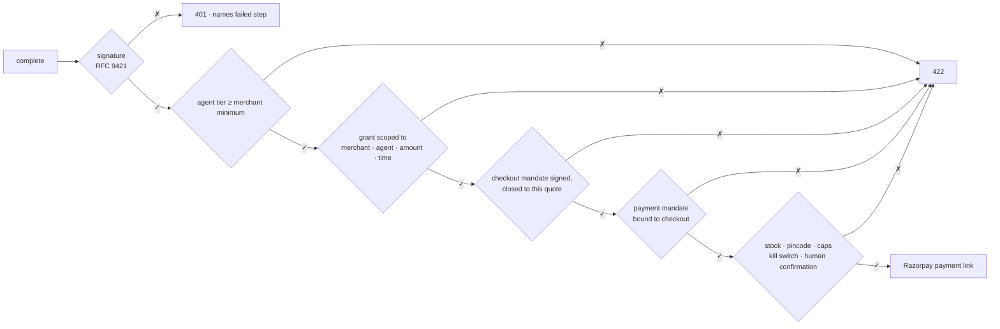
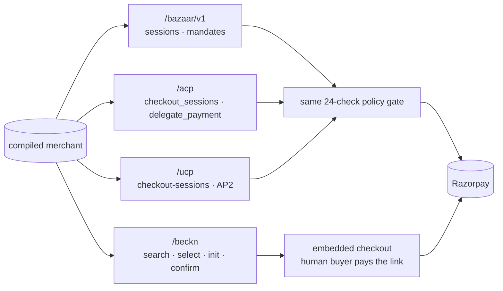

# Bazaar

**Every Indian merchant, transactable by any AI agent — on Razorpay rails, with every rupee bounded, gated and auditable.**

Agentic Payments lets an AI agent *pay*. Bazaar makes the long tail of merchants — a kirana with a Google Sheet, a saree seller on WhatsApp, a packaging distributor — *discoverable, quotable, negotiable and buyable* by agents on Claude, ChatGPT (ACP), Gemini/Shopify (UCP) and ONDC (Beckn), from one compile of whatever catalog they already have.

**Why now:** NPCI is unveiling the **Unified Agent Protocol (UAP)** at GFF 2026 — national rails for AI-led UPI payments, built on UPI Circle delegation and Reserve Pay blocked funds. Those are exactly the primitives Bazaar's Trust Fabric already models ([mapping below](#uap-ready-by-construction)). The pay side is being standardised this month; the supply side — whom an agent can buy from — is still empty. That's Bazaar.

> Razorpay AI Buildathon 2026 · Track 1: AI Growth & Agentic Commerce

---

## Architecture



## How an order happens



## From a messy sheet to agent-ready



The model never sets a price, stock or tax — those come only from the parsers or the merchant.

## What gates every rupee



## One merchant, four protocols



## UAP-ready by construction

NPCI's Unified Agent Protocol (spec lands at GFF, 9–11 Sept 2026) standardises how an AI agent is allowed to pay over UPI. Bazaar's money layer was shaped on the same primitives, so binding to UAP when the spec publishes is an adapter — the same way ACP, UCP and Beckn were:

| UAP builds on | Bazaar already has |
|---|---|
| UPI Circle — delegate payment authority to an agent within a pre-set limit | **Scoped Payment Grant**: one merchant, amount-capped, time-boxed, revocable, every use evented |
| Reserve Pay — blocked funds, multiple debits | **Payment Mandate** binding (`trust/mandates.py`), prod hook already targets Reserve Pay/Autopay |
| Agent onboarding & identity | **Agent Registry** — Ed25519 keys, RFC 9421-signed requests, trust tiers T0–T3 |
| User-set spending rules | **Policy gate** — 24 named checks before any rupee moves, all auditable |

The mandate layer is deliberately isolated (`trust/`), so the UAP binding replaces the demo signing backend without touching sessions, adapters or the policy gate.

## What breaks, and what happens

Failure handling is designed, tested and visible — not an apology:

| What breaks | What happens |
|---|---|
| Model down / key dead / provider outage | **Circuit breaker** (`llm/resilience.py`): after 3 consecutive failures the primary is skipped and the deterministic offline backend answers — quotes, serviceability, checkout all keep working; negotiation degrades to the best pre-approved rule. Every failover lands on the audit chain and the console shows a *degraded* badge. Fallback answers are never written to the model cache. |
| Payment fails | Session stays `ready_for_payment`; the buyer retries the **same** link — no silent retry, the failure is audited |
| Stock race at checkout | Reservation fails → re-quote; nothing charged |
| Tampered / expired mandate, over-cap grant | Named check fails → graceful decline **with reason**; decline is non-terminal, retry with corrected credentials |
| Duplicate `complete` | `Idempotency-Key` returns the original result |
| Forged webhook | HMAC verification rejects it |
| Merchant pulls the kill switch mid-session | New actions refused instantly; nothing in flight is charged |

Try it live: `POST /bazaar/v1/dev/chaos {"model_down": true}` mid-conversation — the buyer never sees a 500.

## Measured (generated, not hand-written — `results/RESULTS.md`)

| | |
|---|---|
| Compiler on 52 merchants / 992 SKUs | name 1.000 · price 1.000 · unit 1.000 · GST 0.916 · stock 0.900 · 26/26 injected rows neutralised |
| 200 buyer tasks (EN/HI/Hinglish, ~40% impossible) | **100% task accuracy · 0 wrong orders** · +8 orders / +₹9.6k GMV vs static price list |
| Red team (17 live probes) | **17/17** — prompt injection, exfiltration, replay, tampered mandates, grant reuse, refund flood, forged webhook, kill switch… |
| Fairness audit | **52/52** merchants · 159,840 cohort simulations · 0 findings |
| Protocol conformance | **24/24** |

## Run it

```bash
pip install -e ".[dev]"            # Python 3.10+
python -m pytest -q                # 68 tests, fully offline
python -m bazaar.simulator.run     # regenerates results/
uvicorn bazaar.gateway.app:default_app --factory --port 8000
cd console && npm install && npm run dev   # http://localhost:5173
```

With `console/dist` built, the gateway serves the console too — one process, one URL: `http://localhost:8000`.

Backends are chosen in `.env` (see `.env.example`): `BAZAAR_LLM=fake|openai|anthropic`, `BAZAAR_RAZORPAY=fake|razorpay`. The offline backend is deterministic and doubles as the model-down fallback. Model calls are cached in SQLite, catalog work is routed to a small model, so a full 200-task run on gpt-4o costs about a dollar and re-runs are free.

**Deploy**: `docker build -t bazaar . && docker run -p 8000:8000 bazaar`, or `flyctl launch --copy-config --now` (Dockerfile and `fly.toml` included). Set `BAZAAR_LLM=openai` + `OPENAI_API_KEY` as secrets to run the Seller Agent on gpt-4o.

## Layout

```
bazaar/
  compiler/      ingest · sanitize · normalize · enrich · exports · readiness
  seller_agent/  intent · offer_engine · tools · propose → verify → execute · MCP
  trust/         registry · http_sig · mandates · grants · policy · ledger · audit · fairness_auditor
  gateway/       app · discover · sessions · checkout · adapters/{acp,ucp,beckn} · playground
  simulator/     tasks · buyer_agent · redteam · run
  conformance/   24-check kit for any Bazaar gateway
console/         merchant console (Vite · React · Tailwind v4)
results/         RESULTS.md · results.json · tasks · task_results
```
